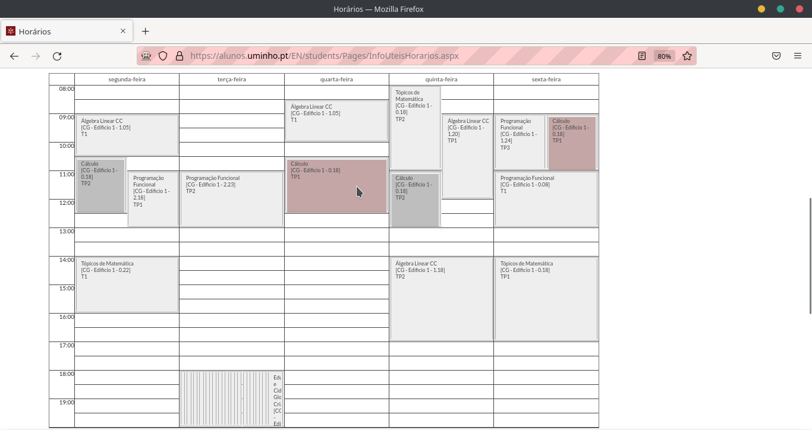

# UMinho Shift Chooser

Extension to help you choosing your best shifts on Universidade do Minho.

Install and open your schedule on UMinho website.

#### Preview (Firefox)



### Developing

##### Dependencies

To install dependencies run 

``` bash
$ npm install

or

$ yarn
```

- - - 

Edit the file `src/index.js` and run

``` bash
$ npm run web-ext run

or

$ yarn web-ext run
```

### Build

Run (after install [dependencies](#dependencies)):

``` bash
$ npm run web-ext build

or

$ yarn web-ext build
```

Access `about:debugging#/runtime/this-firefox` on Firefox and click on `Load Temporary Add-on` and upload the generated .zip file from `web-ext-artifacts` folder.
