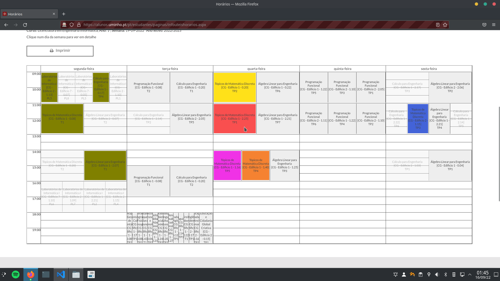

# UMinho Shift Chooser

Extension to help you choosing your best shifts on Universidade do Minho.

Install and open your schedule on [UMinho website](https://alunos.uminho.pt/pt/estudantes/paginas/infouteishorarios.aspx).

#### Preview (Firefox)



https://user-images.githubusercontent.com/49988070/190532973-ac16afd6-09c4-498b-bbcf-f4caec55c0e8.mp4


## Contribute

#### Dependencies

Firstly install the projects dependencies.

``` bash
$ yarn
```

#### Developing

All the typescript files are located at `./src`. 

#### Linting

This project use `EsLint`. To lint run next the script:

```bash
$ yarn lint
```

Also husky is configured to on each commit lint the staged files.

##### VS Code

If you are developing in VS Code, follow [this guide](https://daveceddia.com/vscode-use-eslintrc/) to auto lint on save.

#### Debugging

While developing you can try and debug the extension.

The first script (`start:webpack`) runs babel on every file change.
The second script (`start:firefox` or `start:chromium`) runs web-ext on every file change.

###### Run these commands in separated terminal sessions.

``` bash
$ yarn start:webpack

$ yarn start:firefox
or
$ yarn start:chromium
```

## Build

At this moment the project is not available at any Add-on Store. So you need build it and install it manually.

###### Don't forget to [install dependencies](#dependencies) first.

``` bash
$ yarn build
```

This will generate a `.zip` file in `./web-ext-artifacts`.

#### Firefox

To install it on Firefox, access `about:addons` and drag and drop the `.zip` file on this page.

If for some reason this not work you can try install it temporarily, accessing `about:debugging#/runtime/this-firefox` and clicking on `Load Temporary Add-on` and uploading the `.zip` file.

#### Google Chrome

To install it on Chrome, access `chrome://extensions` and drag and drop the `.zip` file on this page.
